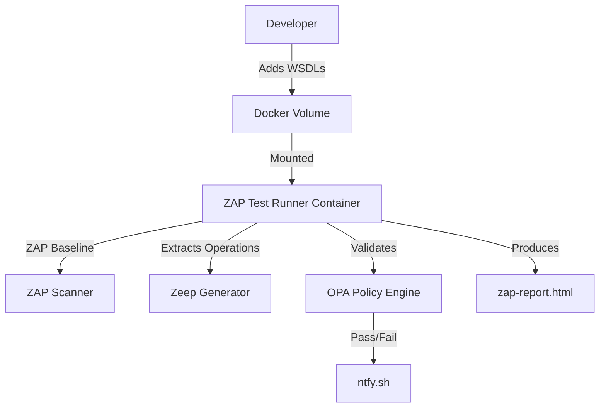

# ZAP WSDL Test Runner with OPA Validation and ntfy Notifications

## 🧪 Purpose
Automated Dockerized test runner for SOAP APIs using OWASP ZAP, WSDL introspection, OPA policy enforcement, and mobile push alerts via ntfy.

## 📦 Features
- Load WSDLs from a volume
- Auto-generate positive/negative test cases
- Run ZAP baseline scans
- Validate test coverage with OPA
- Push pass/fail messages to ntfy

## 🧰 Usage

```bash
docker run --rm \
  -e TARGET_URL="https://env.example.com/api" \
  -e NTFY_TOPIC="zap-test-status" \
  -v $(pwd)/wsdl-tests:/zap/wsdls \
  zap-wsdl-runner
```

## 🔐 Policy Enforcement

Validates that:
- All WSDL operations are tested
- Positive and negative tests exist for each
- Test results are acceptable before progressing CI/CD

## 📈 Architecture



## 📂 Project Structure

```
.
├── Dockerfile
├── entrypoint.sh
├── generate_tests_from_wsdl.py
├── opa/
│   ├── policy/test_coverage.rego
│   └── data/*.json
└── wsdl-tests/
    └── sample.wsdl
```